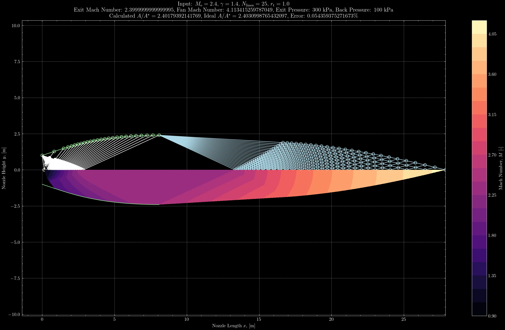

# moc

> *Last Updated: 16 August 2023*

An implementation of the method of characteristics for supersonic nozzle design written in Python.

## Roadmap

For now, I've only implemented minimum-length nozzle design. The plan is to use the baseline algorithm to add more complex features in the future.

Planned nozzle designs:

- [x] minimum-length
- [ ] expansion-straightening
- [ ] axisymmetric

## Example Design

Design of a minimum-length supersonic nozzle using:

- $M_\text{e}=2.4$
- $\gamma=1.4$
- $N_\text{lines}=25$
- $r_\text{t}=1.0$

## Some Theory

Assumptions and general overview of different nozzle designs. In general, the flow is assumed to be

- two-dimensional
- steady
- adiabatic
- irrotational
- shock-free
- isentropic
- supersonic

except in the case of axisymmetric design, where a cylindrical coordinate system is used since the nozzle profile can be rotated around the centerline axis.

### Minimum-length

Minimum-length nozzle design is the simplest way to apply the 2-D MOC. These designs assume that the sonic line at the throat is straight and neglect the expansion section of the nozzle.

All characteristic lines emanate from the sharp corner that defines the throat radius and the compatibility equations are algebraic.

### Expansion-straightening

The flow assumptions here are the same as those in the minimum-length design, but the expansion section is introduced. This complicates how the characteristic lines emanate, but the compatibility equations are still algebraic.

### Axisymmetric

Produces nozzle designs that can be rotated about the centerline axis. Unlike the previous two methods, whose nozzles can only be used in wind tunnel facilities, the nozzles generated using this method can theoretically be flown on rockets. (They will still be far too long and therefore heavy to be flown, [Rao](https://en.wikipedia.org/wiki/Bell_nozzle) nozzles offer a more useful baseline for real-world engine design.)

Now, the compatibility equations involve differentials and must be solved using finite differencing techniques. The general MOC propagation algorithm remains unchanged.

## Other Designs

Three-dimensional methods can be used, along with governing equations that consider rotational flow. MOC can even be coupled with equilibrium or non-equilibrium chemical kinetic solvers to produce nozzles that consider variable gas properties in the flowfield.
